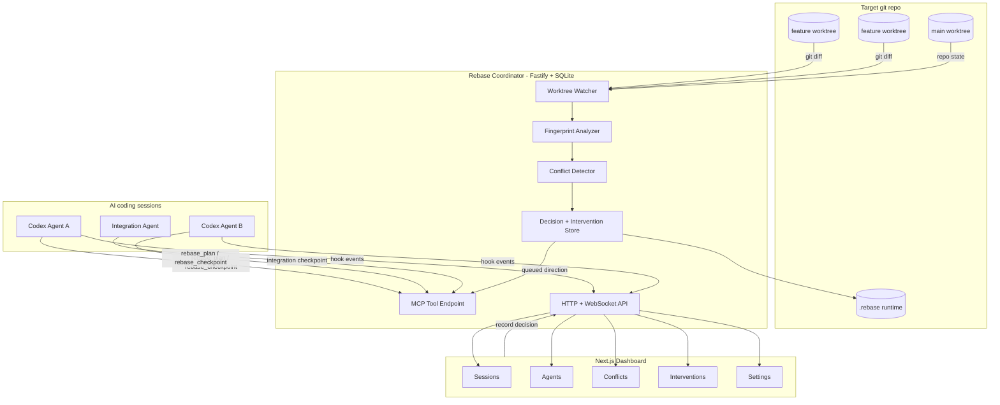

# Rebase

**Local-first coordination for parallel AI coding sessions**

Rebase is a local coordination layer for teams running multiple AI coding agents
against the same git repository. It watches live worktree diffs, fingerprints the
contract surfaces being changed, detects risky overlap before commit or merge,
and gives the user a human-controlled way to send advisory direction back to
Codex through MCP.

The target workflow is intentionally small:

```bash
cd /path/to/any-git-repo
rebase
```

The current repository is a local alpha. Codex is the first supported agent,
Rebase stays advisory rather than autonomous, and the watcher remains the source
of truth even when an agent has not joined through MCP.

## Demo Flow

1. **Start** - Run Rebase from a git repo to create repo-local runtime state,
   launch the coordinator, and open the dashboard.
2. **Observe** - Codex hooks send prompt/tool/session lifecycle evidence
   out-of-band; MCP is reserved for explicit plan, checkpoint, and direction.
3. **Watch** - The coordinator discovers worktrees, watches changed files,
   normalizes git diffs, extracts contract surfaces, and stores fingerprints in
   the local `.rebase/` database.
4. **Detect** - Rebase compares active fingerprints across worktrees and classifies
   overlaps as no issue, a coordination notice, or a blocking conflict.
5. **Decide** - The dashboard or agent chat presents the same choices; the first
   user-approved decision locks the conflict and queues per-agent directions.
6. **Adapt** - Owner agents publish the final contract shape, adapter agents wait
   or revise around that shape, and integration agents converge completed work.

## Architecture

| Layer | Stack | Role |
| --- | --- | --- |
| **CLI** | Node.js - TypeScript - pnpm workspace | Supports `rebase init`, `rebase`, and `rebase status`; prepares `.rebase/`, hook scripts, repo-local env, dashboard, and Codex MCP setup details. |
| **Coordinator** | Fastify - SQLite - Drizzle - Chokidar - MCP SDK | Owns the local runtime API, worktree watcher, fingerprint store, conflict lifecycle, intervention delivery, and MCP tool handlers. |
| **RocketRide** | Local pipeline runtime - Rebase coordination node | Executes required fingerprint, collision, work-order, and merge-risk pipelines; the work-order pipeline can call OpenAI for dynamic coordination plans. |
| **Analyzer** | Git diff normalization - AST-lite extractors - RocketRide-required execution | Turns live changes into bounded fingerprints with touched files, symbols, contract surfaces, semantic summaries, and risk evidence. |
| **Dashboard** | Next.js - React - lucide-react - @xyflow/react | Operator console for sessions, agents, conflicts, interventions, evals, and local settings. |
| **Shared Schemas** | Zod - TypeScript | Defines repo, worktree, session, evidence packet, graph, conflict, debate, advisory, intervention, decision, and publication contracts. |
| **Evals** | Vitest fixtures - coordinator conflict engine | Measures conflict detection recall, false-positive rate, and latency on synthetic multi-agent fixtures. |



## How Coordination Works

Rebase treats coordination as a local evidence pipeline. It does not merge code,
overwrite worktrees, or decide ownership on its own. It detects risk, gives the
user a compact decision surface, and records the resulting directions so agents
can adapt their own plans.

| Step | What Rebase Does | Why It Matters |
| --- | --- | --- |
| **Hook** | Codex hook events auto-register sessions and append local Evidence Packets. | Frequent activity tracking does not spend model tokens. |
| **Join** | `rebase_join` remains available when hooks are unavailable or a session needs explicit registration. | The dashboard can attribute plans, checkpoints, and queued directions to a specific agent. |
| **Plan** | `rebase_plan` records the intended work before meaningful edits. | Peer agents and the dashboard can distinguish intended overlap from accidental drift. |
| **Fingerprint** | The watcher scans dirty worktrees, hashes scoped diffs, extracts files/symbols/surfaces, and stores no raw diffs by default. | Conflict detection has enough structure to reason about contracts without persisting full code changes. |
| **Classify** | Local heuristics and optional OpenAI classification sort overlap into `no_issue`, `coordination_notice`, or `blocking_conflict`. | Compatible additive work can continue, while destructive or ambiguous shared-contract edits pause for direction. |
| **Debate** | Medium/high candidates get a local proposer/skeptic/judge verdict plus token-cost estimate and cloud candidate packet. | The user sees why Rebase would pause and what context would leave the machine. |
| **Decide** | Dashboard buttons and agent-chat choices call the same decision path. | The first approved choice wins, preventing dueling directions across control surfaces. |
| **Intervene** | Rebase queues role-specific directions such as `contract_owner`, `adapter`, `pause_only`, or `compatibility_owner`. | Each agent gets a complementary plan instead of a copied generic instruction. |
| **Publish** | Owners can checkpoint a final contract shape with `publishContract`. | Adapters can wait for and preserve the owner-approved schema/type/API shape. |

## MCP Tools

Codex sessions interact with Rebase through the local MCP endpoint printed by the
CLI. The repo's `AGENTS.md` block tells agents to rely on hooks for frequent
activity evidence, use MCP sparsely for plan/checkpoint/direction, and pause only
on blocking risk.

| Tool | Purpose |
| --- | --- |
| `rebase_join` | Register the current agent session, cwd, agent kind, display name, and coordination role. |
| `rebase_plan` | Record the agent's intended work before meaningful edits. |
| `rebase_checkpoint` | Return current risk, notifications, conflict choices, decisions, publications, and queued directions. |
| `rebase_session_state` | Return current session state, evidence packet id, active risks, and queued directions. |
| `rebase_collision_risk` | Return current collision risk with debate verdicts and cloud packet ids. |
| `rebase_fetch_intervention` | Compatibility path for fetching user-approved queued directions. |
| `rebase_wait_for_direction` | Wait briefly for dashboard or chat direction when a conflict needs user input. |
| `rebase_record_decision` | Record a user-approved conflict choice and queue complementary directions. |
| `rebase_acknowledge_intervention` | Mark a fetched direction as acknowledged after the agent presents its plan. |

If a resumed Codex CLI session loses the MCP tool surface and reports
`unsupported call`, use the token-protected shell fallback from the target repo:

```bash
rebase mcp checkpoint --json '{"sessionId":"..."}'
rebase mcp wait-for-direction --json '{"sessionId":"...","timeoutMs":3000}'
rebase mcp fetch-intervention --json '{"sessionId":"..."}'
rebase mcp record-decision --json '{"conflictId":"...","selectedOptionId":"split-ownership","selectedOptionTitle":"Split ownership","selectedOptionDirection":"...","createdBy":"agent"}'
rebase mcp session-state --json '{"sessionId":"..."}'
```

## Key Endpoints

```text
GET  /health                         -> coordinator health, repo root, DB state, OpenAI state
GET  /api/repo                       -> tracked repository metadata
GET  /api/worktrees                  -> live git worktree topology
GET  /api/events                     -> recent runtime events
GET  /api/events/stream              -> WebSocket event stream
GET  /api/fingerprints               -> active worktree fingerprints
GET  /api/conflicts                  -> live conflicts and coordination notices
GET  /api/agents                     -> joined agent sessions and checkpoint freshness
GET  /api/interventions              -> queued/fetched/acknowledged directions
GET  /api/decisions                  -> active conflict decisions
GET  /api/advisories                 -> generated decision options
GET  /api/contract-publications      -> owner-published contract shapes
GET  /api/evidence                   -> local evidence packets retained for 3 days
GET  /api/cloud-escalations          -> redacted cloud candidate/sent packets
GET  /api/graph                      -> native repo/worktree/file/surface/decision graph
GET  /api/export/events.jsonl        -> event audit export
GET  /api/export/conflicts.jsonl     -> conflict audit export
GET  /api/settings                   -> OpenAI and Codex MCP setup state

POST /api/analyze                    -> force a watcher scan
POST /api/conflicts/:id/advisory     -> regenerate advisory options
POST /api/interventions              -> queue edited user direction
POST /api/decisions                  -> record a dashboard/user decision
POST /api/conflicts/:id/status       -> update conflict lifecycle status
POST /api/hooks/codex                -> ingest Codex hook event and evidence packet

POST /api/mcp/join                   -> HTTP wrapper for rebase_join
POST /api/mcp/plan                   -> HTTP wrapper for rebase_plan
POST /api/mcp/session-state          -> HTTP wrapper for rebase_session_state
POST /api/mcp/checkpoint             -> HTTP wrapper for rebase_checkpoint
POST /api/mcp/fetch-intervention     -> HTTP wrapper for rebase_fetch_intervention
POST /api/mcp/wait-for-direction     -> HTTP wrapper for rebase_wait_for_direction
POST /api/mcp/record-decision        -> HTTP wrapper for rebase_record_decision
POST /api/mcp/acknowledge-intervention -> HTTP wrapper for rebase_acknowledge_intervention
POST /mcp                            -> Streamable HTTP MCP endpoint
```

Mutation endpoints require the local bearer token generated in
`.rebase/runtime.json`.

## Quickstart

```bash
# Install workspace dependencies
pnpm install

# Verify the monorepo
pnpm typecheck
pnpm test
pnpm build

# Start Rebase from this checkout during development
node packages/cli/dist/index.js
```

For a target repository, run the built CLI from inside that repo:

```bash
cd /path/to/your/git-repo
rebase init --yes
rebase
rebase status
```

On first run, Rebase prepares local runtime state:

```text
.rebase/runtime.json   -> coordinator/dashboard URLs, token, DB path
.rebase/rebase.sqlite   -> local coordinator state
.rebase/hooks/codex-hook.mjs -> local hook forwarder
.rebase/.env           -> optional repo-local OpenAI settings
.rebaseignore          -> optional privacy ignore rules for cloud escalation
AGENTS.md             -> optional Rebase coordination instructions
.gitignore            -> optional .rebase/ ignore entry
```

The CLI prints the Codex MCP setup command:

```bash
codex mcp add rebase --url http://127.0.0.1:3747/mcp --bearer-token-env-var REBASE_LOCAL_TOKEN
export REBASE_LOCAL_TOKEN=<token from .rebase/runtime.json>
```

## Required Environment

Rebase uses RocketRide as the required coordination execution layer. In normal
mode, startup fails closed unless RocketRide is online, the Rebase coordination
node is installed, and all required pipelines execute typed smoke inputs.
Heuristic-only behavior is available only through `--skip-rocketride` for local
coordinator development.

Install or refresh the Rebase RocketRide node into a local RocketRide server:

```bash
ROCKETRIDE_SERVER_DIR=/path/to/rocketride-server pnpm rebase rocketride:sync
```

OpenAI is used by the RocketRide `rebase-work-order` pipeline when a key is
configured. The key lets Rebase reason across agent prompts, fingerprints, diffs,
existing contracts, and work orders to create a coordination plan. The hard
merge-risk gate remains deterministic: same-hunk or delete/edit overlap stays
blocking until the final file text is aligned or an integration work order
resolves it.

Repo-local env vars are loaded from the target repo's `.env` and then
`.rebase/.env` when `rebase` starts:

```bash
OPENAI_API_KEY=your_key_here
OPENAI_MODEL=gpt-5.4-mini
```

Shell environment variables win if already set. Because the OpenAI call runs
inside the RocketRide node, start the RocketRide server with the same
`OPENAI_API_KEY` in its environment. Keep `.env` and `.rebase/` out of git; they
are runtime state, not project source.

## Development Commands

```bash
pnpm install          # install workspace dependencies
pnpm typecheck        # TypeScript project references
pnpm lint             # ESLint across the repo
pnpm test             # Vitest test suite
pnpm build            # build all packages/apps
pnpm dev              # dashboard dev server
```

Package-specific commands:

```bash
pnpm --filter rebase-ai build
pnpm --filter @rebase/coordinator test
pnpm --filter @rebase/dashboard typecheck
pnpm --filter @rebase/shared build
pnpm --filter @rebase/evals test
```

## Submission Readiness

Before recording or submitting the internship-challenge demo, run the local
evidence collector from this repo:

```bash
pnpm submission:readiness
```

Then run the live three-agent todo scenario. A passing run must show:

- RocketRide required, validated, and authoritative.
- OpenAI planner configured for dynamic work-order planning.
- One Task-contract coordination episode rather than pairwise churn.
- One user decision in one agent realigning all affected agents.
- Integration-owner work orders for exact overlapping files.
- Adapter checkpoints blocked when `blockedFiles` are still touched.
- Final latest merge-risk assessment `safe:true` with no blocking predicted
  conflicts.
- No open high-risk Task-contract conflicts.

After Rebase reports safe/coordinated, run the external oracle in a disposable
clone: apply each final worktree diff as temporary commits and let normal Git
attempt the merge. This oracle is not part of Rebase's predictive runtime; it is
an audit that the prediction matched real Git behavior.

## Privacy Model

Rebase stores local coordination data under the target repo's `.rebase/`
directory. It persists fingerprints, hook events, Evidence Packets, graph facts,
risk verdicts, debate verdicts, token-cost formula inputs, decisions,
interventions, contract publications, and runtime events. Local Evidence Packets
expire after 3 days by default.

Before cloud escalation, Rebase redacts secrets and paths matched by
`.rebaseignore`. The Privacy dashboard tab shows local evidence packets and cloud
candidate/sent packets with timestamps, provider, redactions, and sent context.

## Current Local Alpha Scope

- `rebase init`, `rebase`, and `rebase status` CLI paths with repo-local runtime setup.
- Codex hook ingestion with sparse MCP plan/checkpoint/direction flow.
- Fastify coordinator with SQLite persistence and token-protected mutations.
- Git worktree discovery, dirty-state tracking, and ignored-path watcher.
- Native SQLite graph for repo, worktrees, files, surfaces, conflicts, agents,
  and decisions.
- AST-lite surface extraction for TS/JS, Python, Java-like files, and generic paths.
- Heuristic fingerprinting with optional OpenAI-backed enrichment.
- Conflict detection, debate verdicts, and token-cost estimates across live
  fingerprints and shared contract surfaces.
- Advisory choices, first-choice-wins decisions, and queued per-agent directions.
- Codex MCP tools for join, plan, checkpoint, fetch, wait, record, and acknowledge.
- Next.js dashboard pages for Sessions, Agents, Conflicts, Interventions,
  Privacy, Evals, and Settings.
- Fixture eval runner for recall, false-positive rate, and latency checks.

## Showcase Demo

See [docs/showcase-demo.md](docs/showcase-demo.md) for the rehearsable two-agent
demo. The scenario creates competing edits to the same Task contract, lets Rebase
detect the conflict, records a split-ownership decision, has the owner publish a
final contract shape, and has the adapter revise around that shape before final
integration.

## Team

Built by **Rebase contributors** for local, human-controlled AI coding
coordination.

## License

MIT. See [LICENSE](LICENSE).
