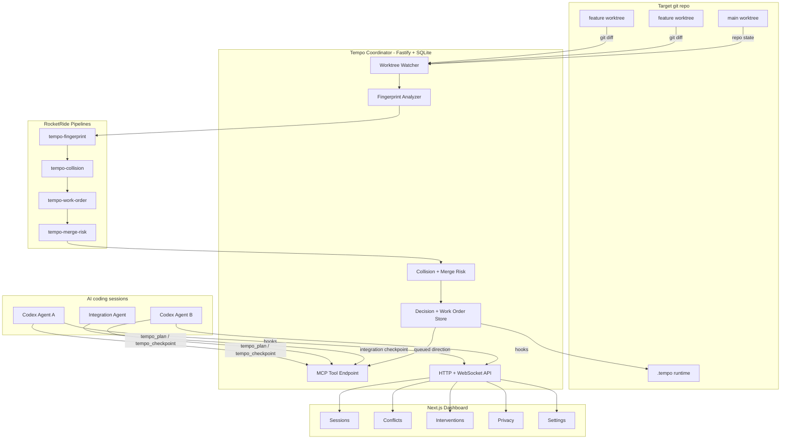

# Tempo

Real-time conflict prediction for AI-coding teams.

Tempo is a local-first coordination layer for teams running multiple AI agents
against the same repository. It watches the code that is being written, extracts
intent fingerprints from live diffs, predicts collisions across worktrees, and
surfaces a human-approved resolution path before agents spend hours and tokens on
branches that will not fit together.

The problem Tempo solves is cost and merge rework. Git is excellent at textual
conflicts, but it only speaks when work is already ready to merge. Tempo catches
the higher-level collisions earlier: semantic contract changes, architectural
ownership conflicts, incompatible API shapes, and intent-level overlap between
parallel coding sessions.

Tempo v1 focuses on lateral collaboration between parallel agents. The same
architecture is designed to extend across the full compatibility surface:
forward to open PRs, backward to main and deployed code, downstream to consumers,
and temporal to roadmap or design intent.

## Demo Flow

1. **Start** - Run `tempo` inside any git repo. Tempo creates repo-local
   runtime state, launches the coordinator, and opens the dashboard.
2. **Observe** - Codex hooks stream session and tool activity into the local
   coordinator without spending model tokens.
3. **Fingerprint** - The watcher reads dirty worktrees, normalizes diffs,
   extracts touched files, symbols, surfaces, and one-line semantic signatures,
   then stores bounded fingerprints in `.tempo/`.
4. **Detect** - RocketRide pipelines compare active fingerprints and classify
   overlaps as clear, coordination notice, or blocking conflict.
5. **Decide** - The dashboard and MCP tools expose the same decision surface:
   split ownership, pause, adapt, or continue. The first user-approved decision
   wins.
6. **Resolve** - Tempo queues role-specific work orders, tracks owner
   publications, keeps adapters aligned to the published contract, and verifies
   final merge risk before integration.

## Architecture

| Layer | Stack | Role |
| --- | --- | --- |
| **CLI** | Node.js, TypeScript, pnpm | Runs `tempo init`, `tempo`, `tempo status`, local MCP fallbacks, runtime setup, and RocketRide node sync. |
| **Coordinator** | Fastify, SQLite, Chokidar, MCP SDK | Owns the local API, worktree watcher, graph store, conflict lifecycle, decisions, interventions, and MCP tools. |
| **RocketRide** | Pipeline runtime with Tempo coordination node | Executes the required fingerprint, collision, work-order, and merge-risk pipelines with typed inputs and outputs. |
| **Analyzer** | Git diff normalization, AST-lite extraction | Converts live changes into bounded fingerprints with files, symbols, surfaces, semantic summaries, and evidence. |
| **Dashboard** | Next.js, React, lucide-react, @xyflow/react | Shows live sessions, worktrees, graph topology, conflicts, decisions, work orders, privacy packets, and settings. |
| **Shared Schemas** | Zod, TypeScript | Defines the contracts for repos, worktrees, agents, evidence packets, graph facts, conflicts, decisions, work orders, and merge risk. |
| **Evals** | Vitest fixtures, coordinator conflict engine | Measures conflict detection recall, false-positive rate, and latency on repeatable multi-agent cases. |



## How Fingerprints Work

Tempo treats every dirty worktree as a live source of coordination evidence.
The watcher keeps source code local, then records compact fingerprints that are
safe to compare quickly:

| Field | Purpose |
| --- | --- |
| `filesTouched` | Scopes which files changed across the worktree. |
| `symbols` | Tracks added, modified, and removed symbols when extractors can infer them. |
| `surfaces` | Groups changes by contract surface such as schema, route, API payload, component props, or generic file path. |
| `semanticSummary` | Captures a short intent signature for the change. |
| `contractChanges` | Names the contracts most likely to affect peer work. |
| `diffHash` | Lets Tempo detect freshness without persisting full source diffs by default. |

## How Conflict Prediction Works

Tempo compares fingerprints every few seconds and uses a three-level
interruption ladder:

| Level | When It Appears | User Experience |
| --- | --- | --- |
| **Clear** | Worktrees do not overlap on meaningful contract surfaces. | Agents keep working. |
| **Whisper / Notice** | Overlap is visible but compatible, usually additive work on the same surface. | Dashboard and checkpoint show awareness without blocking. |
| **Nudge / Stop** | Tempo sees destructive, ambiguous, or high-cost shared-contract risk. | Agents pause for a user-approved direction; nothing auto-applies. |

When a blocking conflict appears, Tempo creates one coordination episode for
the shared surface, estimates merge cost, proposes complementary work orders,
and keeps every agent pointed at the same decision. Owner agents publish the
final contract shape; adapter agents wait for that publication and then revise
around it.

## MCP Tools

Codex connects through the local MCP endpoint printed by the CLI. Hooks provide
frequent session evidence; MCP is reserved for intentional plan, checkpoint,
decision, and direction flow.

| Tool | Purpose |
| --- | --- |
| `tempo_join` | Register an agent session, cwd, agent kind, display name, and coordination role when hooks are unavailable. |
| `tempo_plan` | Record intended work before meaningful edits. |
| `tempo_checkpoint` | Return current risk, notifications, choices, decisions, publications, and queued directions. |
| `tempo_session_state` | Return current session state, evidence packet id, active risks, and queued directions. |
| `tempo_collision_risk` | Return current collision risk with verdicts and cloud packet ids. |
| `tempo_fetch_intervention` | Fetch a queued direction for a session. |
| `tempo_wait_for_direction` | Wait briefly for dashboard or chat direction while a conflict is active. |
| `tempo_record_decision` | Record the user-approved conflict choice and queue complementary directions. |
| `tempo_acknowledge_intervention` | Mark a fetched direction as acknowledged after presenting it. |

If a resumed Codex CLI session loses the MCP tool surface, use the token-auth
shell fallback from the target repo:

```bash
tempo mcp checkpoint --json '{"sessionId":"..."}'
tempo mcp wait-for-direction --json '{"sessionId":"...","timeoutMs":3000}'
tempo mcp fetch-intervention --json '{"sessionId":"..."}'
tempo mcp session-state --json '{"sessionId":"..."}'
```

## Key Endpoints

```text
GET  /health                            -> coordinator health and runtime state
GET  /api/repo                          -> tracked repository metadata
GET  /api/worktrees                     -> live git worktree topology
GET  /api/events                        -> recent runtime events
GET  /api/events/stream                 -> WebSocket event stream
GET  /api/fingerprints                  -> active worktree fingerprints
GET  /api/conflicts                     -> live conflicts and coordination notices
GET  /api/agents                        -> joined agent sessions and checkpoint freshness
GET  /api/interventions                 -> queued, fetched, and acknowledged directions
GET  /api/decisions                     -> active conflict decisions
GET  /api/advisories                    -> generated decision options
GET  /api/coordination-episodes         -> shared-surface coordination episodes
GET  /api/work-orders                   -> per-agent owner, adapter, pause, and integration work orders
GET  /api/merge-risks                   -> latest predictive merge-risk assessments
GET  /api/contract-publications         -> owner-published contract shapes
GET  /api/evidence                      -> local evidence packets
GET  /api/cloud-escalations             -> redacted cloud candidate and sent packets
GET  /api/graph                         -> native repo, worktree, file, surface, and decision graph
GET  /api/settings                      -> OpenAI and Codex MCP setup state

POST /api/analyze                       -> force a watcher scan
POST /api/hooks/codex                   -> ingest Codex hook activity
POST /api/conflicts/:id/advisory        -> regenerate advisory options
POST /api/conflicts/:id/status          -> update conflict lifecycle status
POST /api/interventions                 -> queue edited user direction
POST /api/decisions                     -> record a dashboard or agent-chat decision
POST /api/mcp/join                      -> HTTP wrapper for tempo_join
POST /api/mcp/plan                      -> HTTP wrapper for tempo_plan
POST /api/mcp/checkpoint                -> HTTP wrapper for tempo_checkpoint
POST /mcp                               -> Streamable HTTP MCP endpoint
```

Mutation endpoints require the local bearer token generated in
`.tempo/runtime.json`.

## Quickstart

```bash
# Install workspace dependencies
pnpm install

# Verify the monorepo
pnpm typecheck
pnpm test
pnpm lint
pnpm build

# Start Tempo from this checkout during development
node packages/cli/dist/index.js --yes --skip-rocketride
```

For a target repository, run the built CLI from inside that repo:

```bash
cd /path/to/your/git-repo
tempo init --yes
tempo
tempo status
```

On first run, Tempo prepares local runtime state:

```text
.tempo/runtime.json          -> coordinator/dashboard URLs, token, DB path
.tempo/tempo.sqlite         -> local coordinator state
.tempo/hooks/codex-hook.mjs  -> local hook forwarder
.tempo/.env                  -> optional repo-local OpenAI settings
.tempoignore                 -> optional privacy ignore rules for cloud escalation
AGENTS.md                     -> Tempo coordination instructions for coding agents
.gitignore                    -> .tempo/ runtime ignore entry
```

The CLI prints the Codex MCP setup command:

```bash
codex mcp add tempo --url http://127.0.0.1:3747/mcp --bearer-token-env-var TEMPO_LOCAL_TOKEN
export TEMPO_LOCAL_TOKEN=<token from .tempo/runtime.json>
```

## RocketRide And OpenAI

Tempo is built on RocketRide. Its coordination pipelines map directly onto the
RocketRide node model:

| Pipeline | Input | Output |
| --- | --- | --- |
| `tempo-fingerprint` | dirty worktree evidence | typed `{ fingerprint }` payload |
| `tempo-collision` | active fingerprints | typed conflict and notice candidates |
| `tempo-work-order` | coordination episode plus user decision | per-agent owner, adapter, pause, or integration work orders |
| `tempo-merge-risk` | diffs, hunks, fingerprints, contracts, and work orders | typed predictive `{ mergeRisk }` assessment |

RocketRide is required in normal runtime mode. Startup validates that the
RocketRide server is online, the Tempo coordination node is installed, and the
required pipelines accept typed smoke inputs.

```bash
ROCKETRIDE_SERVER_DIR=/path/to/rocketride-server pnpm tempo rocketride:sync
```

OpenAI is used by the RocketRide work-order pipeline when `OPENAI_API_KEY` is
configured. It can reason across agent prompts, fingerprints, scoped diffs,
contracts, and existing work orders to produce coordination plans. Deterministic
merge-risk rules still gate high-cost cases such as same-hunk overlap or
delete/edit collisions.

Repo-local env vars are loaded from the target repo's `.env` and then
`.tempo/.env`:

```bash
OPENAI_API_KEY=your_key_here
OPENAI_MODEL=gpt-5.4-mini
```

## Submission Readiness

Run the local gates from this repo before sharing:

```bash
pnpm typecheck
pnpm test
pnpm lint
pnpm build
pnpm submission:readiness
```

A complete run should show:

- RocketRide required, validated, and authoritative.
- OpenAI planner configured when dynamic work-order planning is needed.
- One shared-surface coordination episode for a multi-agent contract collision.
- One user decision realigning all affected agents.
- Owner publication before adapters continue disputed contract edits.
- Integration work orders for exact overlapping files.
- Latest merge-risk assessment marked safe after convergence.
- No open high-risk conflicts for the coordinated surface.

## Privacy Model

Tempo stores runtime state under the target repo's `.tempo/` directory. It
persists fingerprints, hook events, evidence packets, graph facts, risk verdicts,
decisions, work orders, interventions, contract publications, and runtime
events. Local evidence packets expire after 3 days by default.

Before cloud escalation, Tempo redacts secrets and paths matched by
`.tempoignore`. The Privacy dashboard tab shows local evidence packets and
cloud candidate or sent packets with timestamps, provider, redactions, and sent
context.

## Repository Layout

```text
apps/dashboard/                 Next.js operator dashboard
packages/cli/                   Tempo CLI and runtime setup
packages/coordinator/           Fastify coordinator, watcher, MCP tools, store
packages/shared/                Shared Zod schemas and TypeScript types
packages/evals/                 Evaluation fixtures and scoring
pipelines/                      RocketRide pipeline definitions
rocketride/nodes/tempo_coordination/
                                Tempo RocketRide node implementation
scripts/submission-readiness.sh Local verification and evidence collector
docs/                           Product and operator documentation
```

## Team

Built by **Tempo contributors** for human-controlled, local-first AI coding
coordination.

## License

MIT. See [LICENSE](LICENSE).
